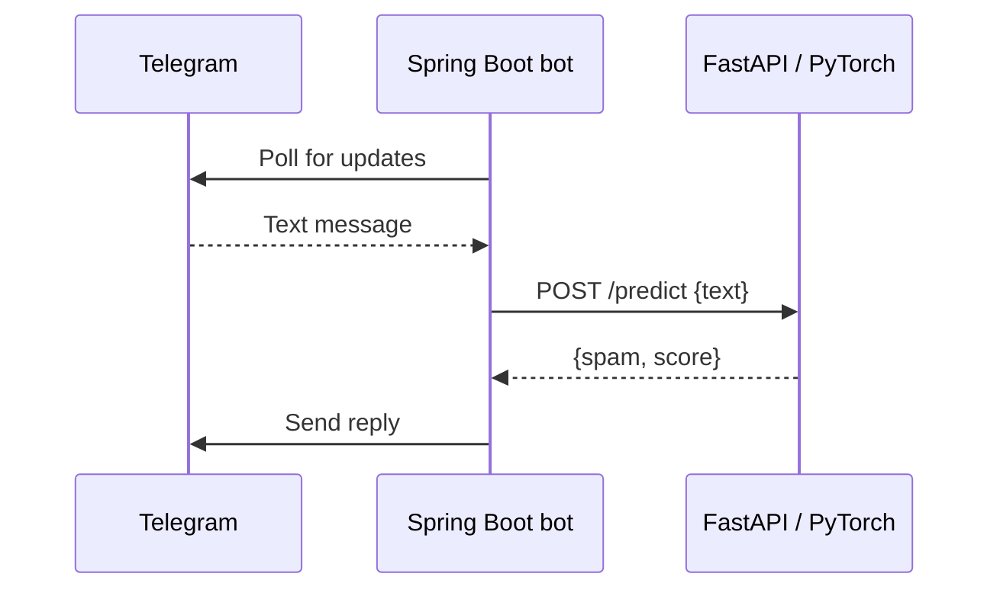

# Telegram Spam Classifier

A Java / Spring Boot Telegram bot that sends Russian-language messages to a Python inference API and replies with the classification result.

This project connects a messaging platform, a Java application and a pretrained language model over HTTP. It is a local integration prototype: the bot replies to messages and does not delete them or ban users.

[Русская версия](README.ru.md) · [Java bot](src/main/java/com/example/anti_spam_telegram_bot/AntiSpamTelegramBot.java) · [Inference API](app.py) · [Model card](https://huggingface.co/ruSpamModels/ruSpam_big)

## What the project demonstrates

- Receiving text updates through the Telegram Bot API using long polling.
- Calling a separate inference service with Spring WebClient and a JSON contract.
- Loading a pretrained Hugging Face model with PyTorch and Transformers, using CUDA when available and CPU otherwise.
- Keeping Telegram credentials and optional model-service configuration outside source code.

The model is **[`ruSpamModels/ruSpam_big`](https://huggingface.co/ruSpamModels/ruSpam_big)**, published by ruSpamModels. This repository contains integration and inference code; it does not contain model training or an independently evaluated dataset. The model author's training-data claims are not results of this project.

## How it works



The Java application ignores non-text updates. It calls the Python service and waits for the result with `.block()`. The Python process loads the model once at import, tokenizes each request with a maximum length of 512 tokens, and applies sigmoid to the model output. A score of at least `0.5` produces `spam: true`.

| Component | Implementation |
| --- | --- |
| Telegram application | Java 17, Spring Boot 3.4.3, Telegram Bots 6.5.0 |
| HTTP client | Spring WebFlux `WebClient` |
| Inference API | Python, FastAPI, Pydantic, Uvicorn |
| Inference runtime | PyTorch, Transformers, Hugging Face Hub |
| Build | Maven Wrapper; Python dependencies in `requirements.txt` |

## Run locally

You need JDK 17, Python 3 with `venv`, and access to Telegram and Hugging Face. Python dependencies are currently unpinned; compatibility depends on the package versions installed. The Maven Wrapper downloads Maven on first use.

Create your own Telegram bot with [BotFather](https://core.telegram.org/bots/features#botfather). Review and accept the model repository's access conditions on [Hugging Face](https://huggingface.co/ruSpamModels/ruSpam_big), then create a read token with access to the model. The first model load downloads its files.

The following commands are for macOS / Linux. On Windows, use `.venv\Scripts\activate` and `mvnw.cmd` with your shell's environment-variable syntax.

```bash
git clone https://github.com/philsyr/telegram-antispam-bot.git
cd telegram-antispam-bot
python3 -m venv .venv
source .venv/bin/activate
python -m pip install -r requirements.txt
```

**Terminal 1 — inference API:**

```bash
source .venv/bin/activate
export HUGGINGFACE_TOKEN="your_hugging_face_read_token"
python -m uvicorn app:app --host 127.0.0.1 --port 8001
```

Before starting Telegram, inspect a prediction response:

```bash
curl -sS http://127.0.0.1:8001/predict \
  -H 'Content-Type: application/json' \
  -d '{"text":"Привет! Во сколько встречаемся?"}'
```

The result should contain `spam` and `score` without an `error` field. A running HTTP server alone does not confirm that the model loaded. Interactive API documentation is available at [localhost:8001/docs](http://127.0.0.1:8001/docs).

**Terminal 2 — Telegram bot, from the repository directory:**

```bash
export BOT_TOKEN="your_telegram_bot_token"
export BOT_NAME="your_bot_username"
export MODEL_SERVICE_URL="http://127.0.0.1:8001"
./mvnw spring-boot:run
```

Open a private chat with **your own bot** and send a text message. If classified as spam, it replies `Обнаружен спам! Сообщение: ...`; otherwise it replies `Hello, <first name>! You said: ...`. Example texts are manual checks, not guaranteed predictions or an accuracy benchmark.

## Configuration

| Variable | Used by | Meaning |
| --- | --- | --- |
| `BOT_TOKEN` | Java | Required Telegram bot token |
| `BOT_NAME` | Java | Overrides `bot.name`; set it to your bot's username, without `@` |
| `MODEL_SERVICE_URL` | Java | Inference API base URL; defaults to `http://127.0.0.1:8001` |
| `HUGGINGFACE_TOKEN` | Python | Token for the gated model repository |
| `HF_TOKEN` | Python | Alternative token variable; `HUGGINGFACE_TOKEN` takes precedence |

[Application properties](src/main/resources/application.properties) contain environment placeholders. A `.env` file is **not loaded automatically** by either application; export variables in the shell that starts each process. Keep real tokens out of tracked files.

## Prediction API

`POST /predict` accepts a JSON object with a required string field, `text`.

```json
{"text": "Кликни здесь и выиграй приз!"}
```

Illustrative response shape; the score below is not a measured result:

```json
{"spam": true, "score": 0.75}
```

`score` is the model's sigmoid output, not a validated probability or a project accuracy metric. When the model cannot load, the current API returns HTTP 200 with `spam: false`, `score: 0.0`, and `error` / `detail` fields. Treat that response as a failed prediction.

## Source map

| File | Responsibility |
| --- | --- |
| [`AntiSpamTelegramBot.java`](src/main/java/com/example/anti_spam_telegram_bot/AntiSpamTelegramBot.java) | Receive messages, call inference, send replies |
| [`BotInitializer.java`](src/main/java/com/example/anti_spam_telegram_bot/config/BotInitializer.java) | Register the bot when the Spring context starts |
| [`app.py`](app.py) | Load the model and serve `/predict` |
| [`pom.xml`](pom.xml) / [`requirements.txt`](requirements.txt) | Java and Python dependencies |

## Current limitations and next steps

- **Failure handling:** the Java client currently reads only `spam`, so an unavailable-model response can produce an ordinary greeting. Transport exceptions produce a greeting with an error suffix. Distinguishing unavailable inference from a clean classification is the first reliability improvement.
- **Request execution:** the Java handler blocks while waiting for inference; no explicit request timeout, retry policy or rate limiting is configured. This is not a fully reactive processing pipeline.
- **Model evaluation:** the threshold is fixed at `0.5`; long text is truncated. The repository has no local precision/recall, latency or throughput measurements.
- **Deployment:** the prediction endpoint has no authentication. The local instructions bind it to loopback. The project has no deployment configuration, persistent storage or moderation actions.
- **Tests:** the existing Java test only loads the Spring context, which also tries to register the bot with Telegram. There are no isolated classifier-contract or message-handler tests yet. Add those before relying on automated verification of behavior.

To compile and package the Java application without starting the context test:

```bash
./mvnw -DskipTests package
```

This checks the Java build; it does not verify Telegram connectivity, model availability or prediction quality.

## Licenses and attribution

The application source is covered by the repository's [MIT license](LICENSE). The pretrained model has its own license: its [Hugging Face model card](https://huggingface.co/ruSpamModels/ruSpam_big) lists **CC-BY-NC-ND-4.0**. Review the model's license and access conditions separately before using or distributing it.
